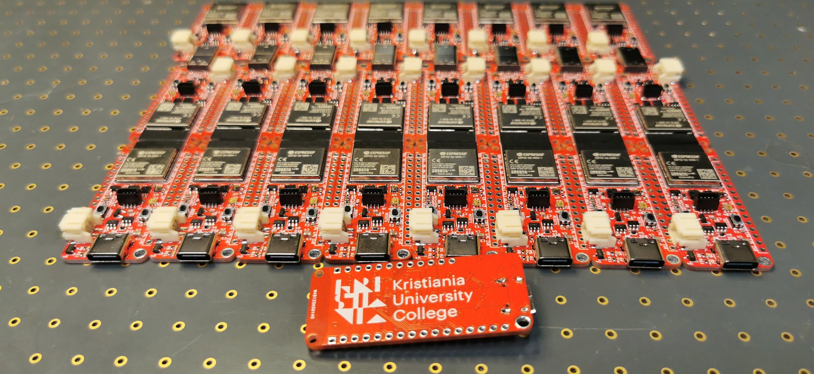

# LectureFeather
A Feather dev board based on ESP32-S3, made for lecturing Embedded Systems and M2M. Feel free to use these Kicad files to make your own boards for use in your own lectures.

## Thanks to Adafruit
This board is based on the Feather ESP32-S3 from Adafruit and while I have remade the project in Kicad, the job was so much easier thanks to all the great work and research by Adafruit. Thus I'm keeping with the [CC-BY-SA3.0 license](./license.txt) so be sure to share if you redistribute/remake.

This board will make it really easy for my students to extend the base functionality using FeatherWings and Stemma sensors from Adafruit. I highly recommend Adafruit products and they do fantastic work for the hardware commmunity.

## Usage
To use the board, set the Arduino IDE, PlatformIO or another IDE to use the board named "Adafruit ESP32-S2 Feather". This will ensure proper operation so that defines such as LED_BUILTIN and auto-programming will work. Refer to the original [Adafruit Guide](https://learn.adafruit.com/adafruit-esp32-s2-feather) for details.

As in the Adafruit design, special features are on these pins:
* I2C is on IO03 and IO04. Initiate I2C using wire.begin(3,4);
* Separate power supply for I2C devices are on IO07. Set this low before going into low power mode.
* LED_BUILTIN is on IO13

Here are some differences from the Adafruit design:

* Light/lux sensor (LTR-329) on I2C address 0x29
* Temperature/moisture sensor (SHT31) on I2C address 0x44
* Accelerometer (LIS3DH) on I2C address 0x18
* The Hall sensor (MT8691AT) is on IO01. Larger ESP modules have this builtin, but the Mini modules do not, so I added this.
* I've also swapped the Neopixel (ws2812-type) to a Dotstar (APA102-2020). This is using IO33 for data and IO21 for clock.
* I've removed the LC709203 battery monitor as that wasn't available for months and I could not easily find a good alternative.

## Project files

### PCB
The [PCB folder](./pcb) holds all the Kicad files I've used for making my boards. Please do not include any logos if you remake this board. Here you'll also find the Errata for versions of this board.

### Code
The [Example folder](./examples) holds a single .ino file that will test all the features of the board. Lots of libraries are required, so be sure to read the Include section of the file. Project file for PlatformIO used for default firmware [can be found here](https://github.com/jenschr/TestAll).

Please note that to make ESP32-S3 work painless in PlatformIO [ref](https://github.com/espressif/arduino-esp32/issues/6762#issuecomment-1182821492), we need to add the following two lines to platformio.ini:

    monitor_speed = 115200
    build_flags = -DARDUINO_USB_MODE=1
    
Note that if you use PlatformIO, I wrote up a [long article on how to solve the most common issues with the ESP32-S3 for PlatformIO on my blog](https://flashgamer.com/blog/comments/solving-platformio-issues-with-the-adafruit-feather-s3).

### BOM
The [HTML BOM](./bom) lists all the components used in the design and shows their position on the board. Great for curious students that want to know it all.
